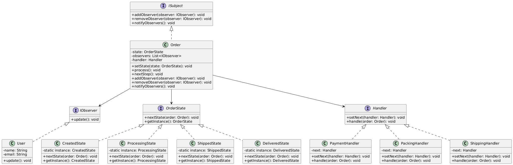

# iFood Like

Fazer um trabalho usando, no mínimo, os padrões Observer, Chain of Responsability, State, Singleton, para uma aplicação que simule um sistema de entrega, notificando os usuários a cada modificação no estado do pedido.

---
**Diagrama:**

