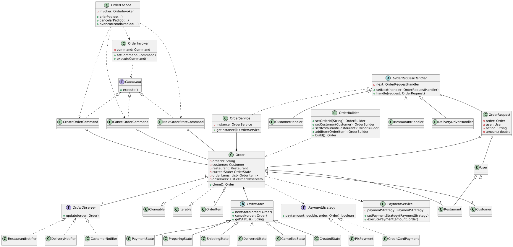

# iFood-like

Simulação de um sistema de entregas utilizando os *design patterns* Observer, Chain of Responsability, State, Singleton e Strategy.

* **Diagrama de Classes:**
    * versão 1:

    * versão 2:

* **State:**

